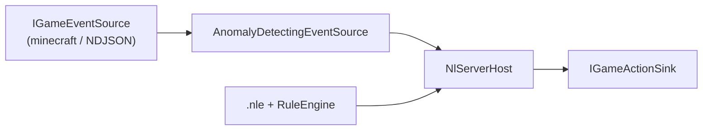

# NL Anti-Cheat Signals (Phase 5)

Phase 5 is **not** a full client-side anti-cheat product. Per
[`ROADMAP.md`](../ROADMAP.md) and nl.txt ("the more complex the NLEvent config, the better
the anti-cheat"), it:

1. Defines concrete "impossible action" / anomaly detectors for Phase 3 session streams
2. Emits those as ordinary `GameEvent`s into the same `RuleEngine` pipeline

Streamers author `.nle` rules against `anomaly*` event names the same way they author rules
for `shoot` or `playerChat`.

## Architecture



`AnomalyDetectingEventSource` decorates any Phase 3 source: for each real event it yields the
original, then any detector signals mapped to `SessionEvent`s. `NlServerHost` /
`RuleEngine` stay unchanged.

| Piece | Role |
|---|---|
| `IAnomalyDetector` | Stateful observer → zero-or-more `AnomalySignal`s |
| `AnomalyPipeline` | Runs all detectors; `CreateDefault()` wires the three built-ins |
| `AnomalyEventMapper` | Signal → `GameEvent` (`anomaly*` name + numeric props) |
| `AnomalyDetectingEventSource` | Source decorator used by `NL.Server --anti-cheat` |

## Built-in detectors ("impossible action" vocabulary)

| Kind | `GameEvent` name | What it means |
|---|---|---|
| `ImpossibleAction` | `anomalyImpossibleAction` | Gameplay action (`shoot` / `move` / `useItem` / `attack`) while the player is known-dead (after `playerDeath`/`death`, before `respawn`/`playerJoin`) |
| `RateSpike` | `anomalyRateSpike` | Same event name from one player ≥ N times inside a sliding window (default: 8 in 1000 ms) |
| `Teleport` | `anomalyTeleport` | One-step position jump over distance or speed threshold (reads `player.x` / `player.y` / `player.z`) |

Shared numeric props on every anomaly event: `anomaly.kind`, `anomaly.severity` (1=rate,
2=impossible/teleport). Kind-specific props: `anomaly.count` / `anomaly.windowMs` (rate),
`anomaly.distance` / `anomaly.speed` (teleport), `anomaly.playerAlive` (impossible).

Thresholds live in `AnomalyThresholds` (tunable; defaults are aggressive for the sample demo).

## Working sample

```bash
dotnet run --project src/NL.Server -- --game generic \
  --config samples/configs/anti-cheat.nle \
  --source samples/events/anti-cheat-sample.ndjson \
  --replay --anti-cheat
```

Narrative in the NDJSON stream:

- **Alice** — clean join / shoot / small moves → no anomalies
- **Eve** — dies then shoots → `anomalyImpossibleAction` → **Block**
- **Eve** — eight rapid shoots after respawn → `anomalyRateSpike` → **Block**
- **Eve** — jumps ~190 units in 50 ms → `anomalyTeleport` → **Block**

Optional NDJSON `ts` (Unix ms) makes rate/teleport windows deterministic under `--replay`
(without it, detectors use wall-clock time — fine for live tails).

## CLI

```
NL.Server ... --anti-cheat
```

Works with `--game minecraft` or `--game generic`. Pair a Minecraft live session with an
`.nle` that includes `event anomalyImpossibleAction:` / `anomalyRateSpike:` blocks to act on
detections (e.g. via `--rcon`).
