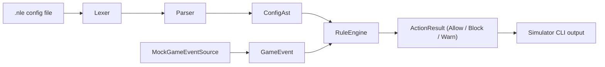

# Architecture — Phase 0 Prototype

This describes only the current Phase 0 slice (NLEvents language + rule engine). See
[ROADMAP.md](../ROADMAP.md) for how this fits into the larger NL idea from
[nl.txt](../nl.txt).

## Components

- **`Lexer`** (`src/NL.Core/Lexer.cs`) — turns `.nle` text into a flat `Token` stream,
  including synthetic `Indent`/`Dedent` tokens derived from leading whitespace
  (Python-style blocks). Throws `NlSyntaxException` on tabs, unterminated strings,
  unknown characters, or inconsistent dedents.
- **`Parser`** (`src/NL.Core/Parser.cs`) — a small recursive-descent parser that turns
  tokens into a `ConfigAst` (see `src/NL.Core/Ast/`): one `EventBlock` per `event` clause,
  each holding a list of `Statement`s (`ActionStatement`, `WarnStatement`, `IfStatement`).
- **`RuleEngine`** (`src/NL.Core/RuleEngine.cs`) — the enforcement half. Built from a
  `ConfigAst`, it evaluates incoming `GameEvent`s against the matching `EventBlock` and
  returns an `ActionResult` (`Allow` or `Block`, with an optional warning message). It also
  runs a light static check at load time (`LoadWarnings`) to flag rule branches that could
  fall through with no explicit action.
- **`GameEvent`** (`src/NL.Core/GameEvent.cs`) — a name plus a bag of numeric properties
  (e.g. `player.health`). This is the seam where a real game integration would plug in later
  (Phase 3 of the roadmap) instead of `MockGameEventSource`.
- **`MockGameEventSource`** (`src/NL.Simulator/MockGameEventSource.cs`) — produces a fixed,
  narrated sequence of fake events so the CLI can demonstrate the engine end to end without
  touching any real game.
- **`NL.Simulator` CLI** (`src/NL.Simulator/Program.cs`) — loads a `.nle` file (or a built-in
  default), builds a `RuleEngine`, runs the mock event script through it, and prints each
  event alongside the engine's decision.

## Why this shape

- Splitting Lexer / Parser / RuleEngine mirrors how the real NL client would eventually need
  a compiler-like pipeline for streamer-authored configs — even though v0.1's grammar is tiny.
- `GameEvent` is deliberately just "a name + numeric properties" so swapping the mock source
  for a real game hook later doesn't require changing `RuleEngine` at all.
- Everything here is plain text and unencrypted, unlike the closed-source `.nle` packaging
  described in `nl.txt` — that's an intentional simplification for a prototype, not a decision
  about the eventual real product.
