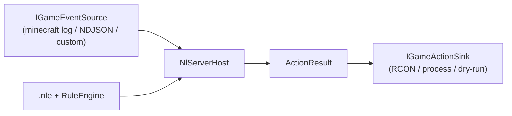

# NLServer — Phase 3 (complete): game-agnostic real server integration

Phase 3 replaces `MockGameEventSource` with **real session events** from a running (or
recorded) game server, evaluated by the same Phase 0 `RuleEngine`, with optional real
actions on `Block`.

This is **not** Minecraft-only. The host is game-agnostic: Minecraft is one built-in
adapter; any other game can plug in by emitting a tiny NDJSON event stream (or by
implementing `IGameEventSource` / `IGameActionSink`).

## Architecture



| Piece | Role |
|---|---|
| `IGameEventSource` | Yields `SessionEvent`s (`GameEvent` + optional player name) |
| `IGameActionSink` | Applies Block decisions back to the game |
| `NlServerHost` | Shared evaluate loop — no game-specific code |
| `SessionEvent` | `GameEvent` stays "name + numeric props"; player id stays alongside |

`RuleEngine` was **not** changed.

## Built-in games

### `minecraft`

Tails or replays a vanilla/Paper Java server `logs/latest.log`.

```bash
dotnet run --project src/NL.Server -- --game minecraft --config samples/configs/minecraft.nle --source samples/logs/minecraft-sample.log --replay
```

Live with RCON:

```bash
dotnet run --project src/NL.Server -- --game minecraft --config samples/configs/minecraft.nle --source C:\mc\logs\latest.log --rcon 127.0.0.1:25575:secret
```

Event vocabulary: `playerJoin`, `playerLeave`, `playerChat`, `playerDeath`, `playerAdvancement`
(see older [NLSERVER_MINECRAFT.md](NLSERVER_MINECRAFT.md) table; death templates expanded).

### `generic` — any game

Any engine/mod/plugin writes **NDJSON** lines:

```json
{"event":"shoot","player":"Alice","props":{"weapon.damage":12}}
```

Required: `event` (string). Optional: `player` (string), `props` (object of numbers/bools).
Lines starting with `#` are comments.

```bash
dotnet run --project src/NL.Server -- --game generic --config samples/configs/generic.nle --source samples/events/generic-sample.ndjson --replay
```

This is the intended path for **any title** without shipping a C# adapter: emit NDJSON, write
a `.nle` file whose event names match, run NLServer.

## Actions on Block

| Flag | Behavior |
|---|---|
| *(none)* | Dry-run: print what would be applied |
| `--rcon host:port:password` | Source RCON (Minecraft defaults: join→`kick`, else→`tell`) |
| `--rcon-cmd "say blocked {player}"` | Custom RCON template (`{player}` `{event}` `{decision}` `{message}`) |
| `--action-cmd "..."` | Shell process for non-RCON games (same placeholders) |

## CLI

```
NL.Server --game <minecraft|generic> --config <file.nle> --source <path>
          [--replay] [--rcon host:port:password] [--rcon-cmd "..."] [--action-cmd "..."]
          [--anti-cheat]
```

`--replay` reads the whole source from the start and exits (CI / demos). Default is live
follow from the current end of the file. `--anti-cheat` wraps the source with Phase 5
anomaly detectors — see [ANTICHEAT.md](ANTICHEAT.md).

Legacy positional args still work as Minecraft live mode:
`NL.Server <config.nle> <log-path> [rconHost] [rconPort] [rconPassword]`.

## Where the code lives

- `src/NL.Server.Core/` — interfaces, `NlServerHost`, Minecraft parser/mapper, generic NDJSON
  parser, RCON packet framing, recording/null sinks
- `src/NL.Server/` — file reader, line event source factories, RCON/process/console sinks, CLI
- `samples/logs/minecraft-sample.log`, `samples/events/generic-sample.ndjson`
- `samples/configs/minecraft.nle`, `samples/configs/generic.nle`
- `tests/NL.Server.Core.Tests/` — parsers, mapper, host, RCON wire format

## Phase 3 completion status

- [x] Game/engine target decided: **pluggable adapters**, with Minecraft + universal NDJSON
- [x] Real event vocabulary for Minecraft; arbitrary for generic
- [x] Wired into existing `RuleEngine` with no engine changes
- [x] End-to-end validated via `--replay` against checked-in sample sources (both adapters)
- [x] Real action channels: RCON + generic process sink + dry-run
- [x] Broader Minecraft death-message coverage
- [ ] Optional later: native adapters (Paper plugin, Source engine log, etc.) — not required;
      NDJSON covers "any game" without new C# per title
