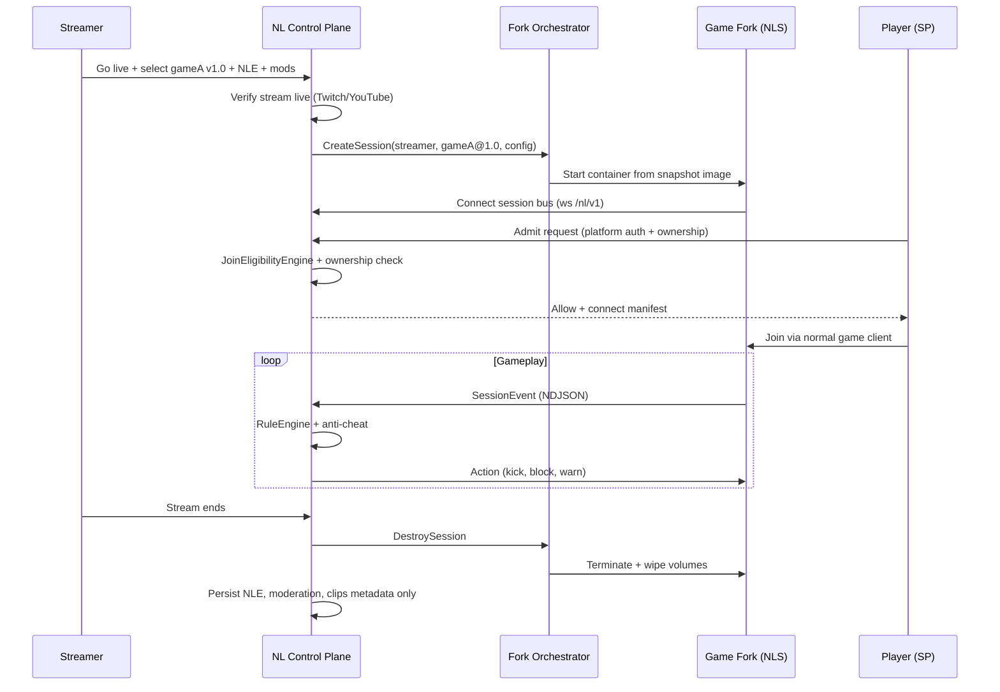

# NL Fork Platform — Architecture Sketch

This document describes the **fork-platform track** (ROADMAP Phases L–S): the updated NL
vision where games run on **NL-controlled servers**, players use **normal clients** after
**ownership proof**, and sessions are **ephemeral** with **no progress transfer** to
publisher servers.

Source intent: [`NexoraLive.txt`](../NexoraLive.txt) sections 4–5 (NLS, ownership, enforcement).

What's built today (Phases 0–K) is the **control plane** — rules, moderation, session bus, demo.
This doc is the **data plane** target — actual game forks on NL infrastructure.

---

## Problem statement

Streamer community sessions on **publisher matchmaking** cannot enforce streamer-authored
rules:

- No server-side mod loading for viewers
- No per-streamer kick/boundary/weapon rules
- Client anti-cheat is publisher-scoped, not session-scoped
- Open invites let random players join

NL solves this by hosting a **licensed fork snapshot** per session, applying **NLE configs**
and **server mods** on that fork, and routing players only through **NL join admission**.

---

## Lifecycle (one stream session)



---

## Core components

| Component | Responsibility | Builds on |
|-----------|----------------|-----------|
| **Identity service** (L) | Platform OAuth, game ownership, anti-alt | Phase D admit API |
| **Social gate** (M) | Live follow/sub, SP standing, live-only NLS | Phase 2 SP model, Phase 4 moderation |
| **Fork catalog** (N) | Major-version snapshots, partnership tier, mods | Built — `NL.Fork.Catalog`, `/fork-catalog.html` |
| **Orchestrator** (O) | Create/destroy ephemeral fork instances | Phase D–G Docker, session bus |
| **Fork runtime** (P) | In-process events + actions, server mods | Phase A integration spec, Phase 3 host |
| **Partnership layer** (Q) | Official vs at-own-risk, legal gates | New |
| **NL Client** (R) | Join UX, overlay, invite filtering | Phase B–H web UI patterns |
| **Fleet ops** (S) | Multi-region, scaling, observability | Phase K hardening |

---

## Snapshot versioning

| Rule | Rationale |
|------|-----------|
| **Major versions only** (`1.0`, `2.0`) | Limits storage; one fork image per publisher major release |
| Patches roll into current major image | Streamers always get latest patch within major |
| Deprecate oldest major when over quota | Force migration; optional auto-update client prompt |
| Client must match major | Mismatch → block join with clear message |

NL does **not** host every patch line — only majors unless storage allows and publisher agrees.

---

## Partnership tiers

| Tier | Who opts in | User experience | Legal |
|------|-------------|-----------------|-------|
| **Official** | Publisher SDK / menu button | "Play on NL" in game; full EULA alignment | Publisher-approved |
| **Platform** | Platform (e.g. Steam app flag) | NL hosts any opted-in app id on that platform | Platform agreement |
| **At own risk** | NL + streamer only | Banner: not endorsed; no progress transfer | User acknowledgment required |

NL never sells game copies, DLC, or in-game currency. Publishers retain all monetization.

---

## What gets persisted vs discarded

| Persist after session | Discarded with fork |
|----------------------|---------------------|
| Streamer's `.nle` config | World / save state |
| Moderation JSONL | Player inventory on fork |
| SP standing / offenses | Session-specific mods runtime |
| Clip metadata / logs | Fork container volumes |
| Orchestrator audit trail | Any "progress" that would sync to publisher |

Explicit product rule: **nothing from NL sessions writes to Rockstar Cloud / Riot MMR / etc.**

---

## Enforcement layers (all must pass)

```text
1. Ownership     — Steam/Epic/… proves user owns gameA
2. Join gate     — SP standing, follow/sub, offenses, graylist
3. NLE rules     — per-event Allow/Block/Warn
4. Anti-cheat    — anomalies + packet/state validation on fork
5. Operator      — mod/admin volatile NLS controls (kick all but SPs, etc.)
```

Layers 1–3 exist in the repo today (1–2 as models/APIs; 3–5 as working code). Phases L–P
wire 1–2 to real platforms and move 3–5 **inside** the fork.

---

## Relationship to today's bridge path

```text
                    ┌─────────────────────────────────────┐
                    │         NL Control Plane            │
                    │  SessionHost.Web · RuleEngine · …   │
                    └──────────────┬──────────────────────┘
                                   │
              ┌────────────────────┼────────────────────┐
              │                    │                    │
              ▼                    ▼                    ▼
     ┌────────────────┐  ┌────────────────┐  ┌────────────────┐
     │ Bridge path    │  │ Bridge path    │  │ Fork path (L–P)│
     │ (now)          │  │ (now)          │  │ (target)       │
     │ Minecraft log  │  │ BeamNG NDJSON  │  │ NL-hosted      │
     │ + your server  │  │ + Lua mod      │  │ gameA@1.0      │
     └────────────────┘  └────────────────┘  └────────────────┘
```

Bridges remain for streamers who already run their own dedicated server. Fork path is required
for titles with no server access (most AAA).

---

## Suggested first implementation slice (Phase L + O minimal)

Smallest vertical proof of the fork model **without** a real AAA title:

1. **L-lite:** Mock ownership provider + real admit denial in API
2. **O-lite:** Orchestrator spins **`hello-fork`** container (not a real game) that speaks
   integration spec v1 over WebSocket
3. Reuse **demo.nle** + **nl_bridge.py** pattern inside the container
4. **Destroy on timer** — prove ephemeral lifecycle

Then swap `hello-fork` for **Minecraft dedicated** image as first real fork (Phase P).

---

## Open questions (resolve during L–Q)

- **Licensing:** How does NL obtain rights to host fork binaries? (Partnership vs streamer-owned
  dedicated server license)
- **Client connect:** Direct IP to fork vs NL relay vs publisher launcher deep-link
- **Console:** Limited without first-party SDK partnership
- **Anti-cheat coexistence:** Publisher EAC/Vanguard on client while NL validates server-side

---

## Related docs

- [ROADMAP.md](../ROADMAP.md) — Phase L–S checklists
- [NL_INTEGRATION_SPEC.md](NL_INTEGRATION_SPEC.md) — bridge contract (fork runtime implements this)
- [NL_SESSION_SERVER.md](NL_SESSION_SERVER.md) — current session server (control plane)
- [SP_MODEL.md](SP_MODEL.md) — join eligibility model
- [NexoraLive.txt](../NexoraLive.txt) — original vision paper
